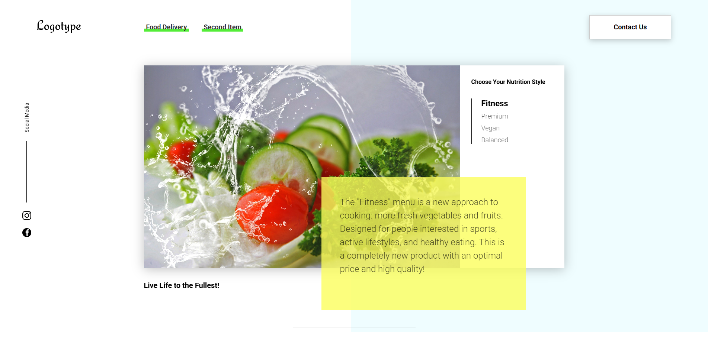

# Interactive Website with Tabs, Slider, Calorie Calculator and More

This website focuses on providing a range of interactive features aimed at enhancing user experience and functionality. While it is not mobile-optimized, it offers several key features designed for desktop usage.
The project is designed to offer a seamless experience with these interactive elements, though it is not yet mobile-friendly.

## Live Demo
You can view the live version of this website at:
https://peppy-mousse-b7067d.netlify.app/

## Features

- Tabs: Allow users to switch between different sections of the website smoothly.
- Slider: A dynamic image or content slider to showcase various items or information.
- Calorie Calculator: A tool that helps users calculate their daily calorie intake based on input data.
- Remote Data Fetching: The website fetches data for cards from an external file, ensuring that content is always up to date.
- POST Requests: The site supports sending POST requests to a server to submit data, providing backend interaction.
- Countdown Timer: A functional countdown timer that can be used for various time-based activities or events.
- Modal Windows: Interactive pop-up modals that provide additional information or actions when needed.

## Technologies Used

- HTML5
- CSS3
- JS
- PHP (handles POST requests for server-side communication)
- json-server (remote data from an external source)
- Webpack (module bundling, ensuring efficient loading and optimized performance)

## Installation

1. Clone the repository:
   ```bash
   https://github.com/yurazablotskiy/Food_fitness.git
